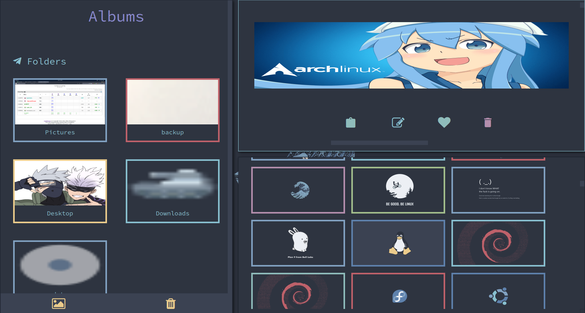

  

# GalleryMan

 - Gallery written in Python to manage your photos

<hr>

# Installation

 - Install manually:

    ```
    git clone https://github.com/0xsapphir3/galleryman
    cd galleryman/
    python setup.py install
    ```
 
- Install from PyPi
    
    <a href="https://pypi.org/project/galleryman/">PyPi Project Link</a>
    
    ```
    pip install galleryman
    ```
    
- For Arch Linux Users:

    <a href="https://aur.archlinux.org/packages/galleryman-git/">Arch User Repository (AUR) </a>
    
    Install via AUR helper (yay):

    ```
    yay -S galleryman-git
    ```
- After Installing, Run:

   ```galleryman --init```

<hr>

# Features

- **Customizable** - Easily customize the application according to your wishes

- **Responsive** - The application's content are resized according to the size of the application. So it is compatible with any resolution.

<hr>

# Notes:

- Notes on how to use doodle images: 

     - Free hand - Drag the mouse to draw lines. Press Ctrl+S to save the drawing. Press Ctrl+Z and Ctrl+Y to undo and redo, respectively. 

     - Rectangle - Drag the rectangle with your mouse and then place at your own position.

     - Line - Everying is in the Menu. Press Ctrl+S to save.

     - Circle - Same as that of line

     - Line connection - Click on a point of init a line and move the mouse to increase the size. Rest will be displayed on the screen.

# Screenshot:

   

# Pull Requests

- Pull Requests Are Welcome!

<hr>
